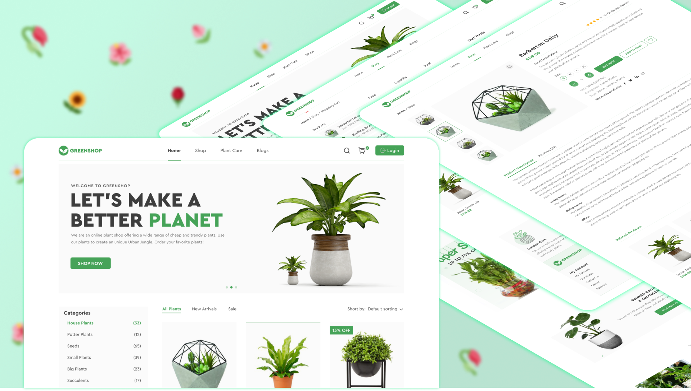

# Green Shop
#### ver.0.1.0

## Stack who I use
### Libs
- react
- vite ( plugins: [svgr] )
- react router
- formik
- keen slider
- redux
- yup
- react-scroll

### Linters
- eslint
- prettie


> Also i use gh-pages for deploy site on github server.

I need to do

1) adaptiv for mobile
2) do buisnes logic
3) Connect simple server with data and func auth
4) Add loaders on page

## How see this project 

### 1 variant 

You can visit host with this [site](https://vladislavkori.github.io/GreenShop-site/) 

### 2 variant 

You need to clone git repo
```git clone https://github.com/VladislavKori/GreenShop-site.git```

Install libs in projects

``` cd GreenShop-site```
``` npm install```

Then you can start vite dev server, with help:
```npm run dev```

Also you need open a browser and paste the link on localhost server:
```http://127.0.0.1:5173/GreenShop-site```

That`s all, you can see my site and reduct the code.  